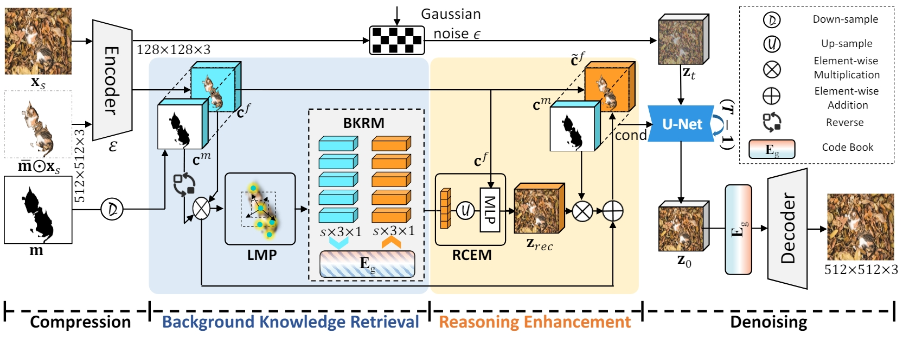
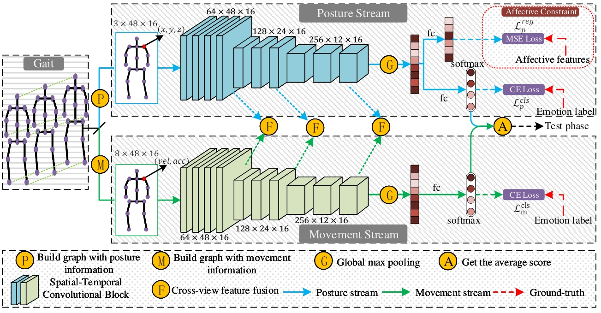
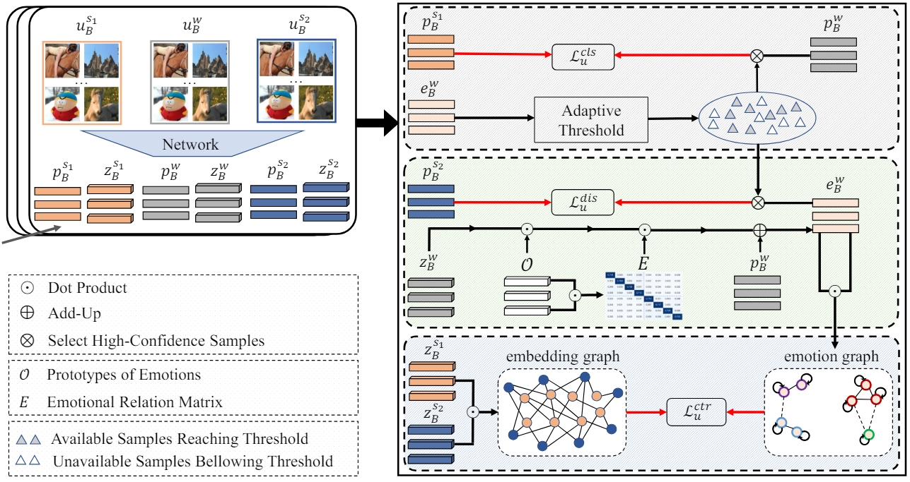
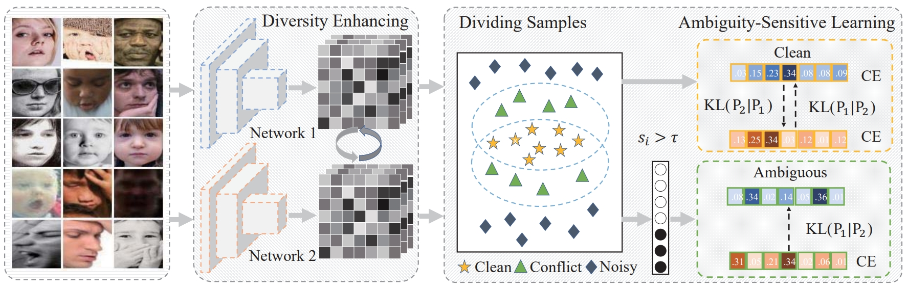
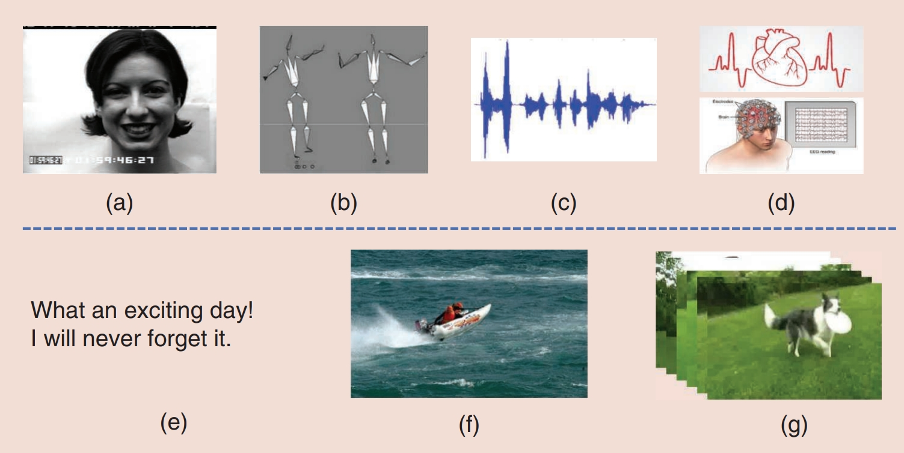
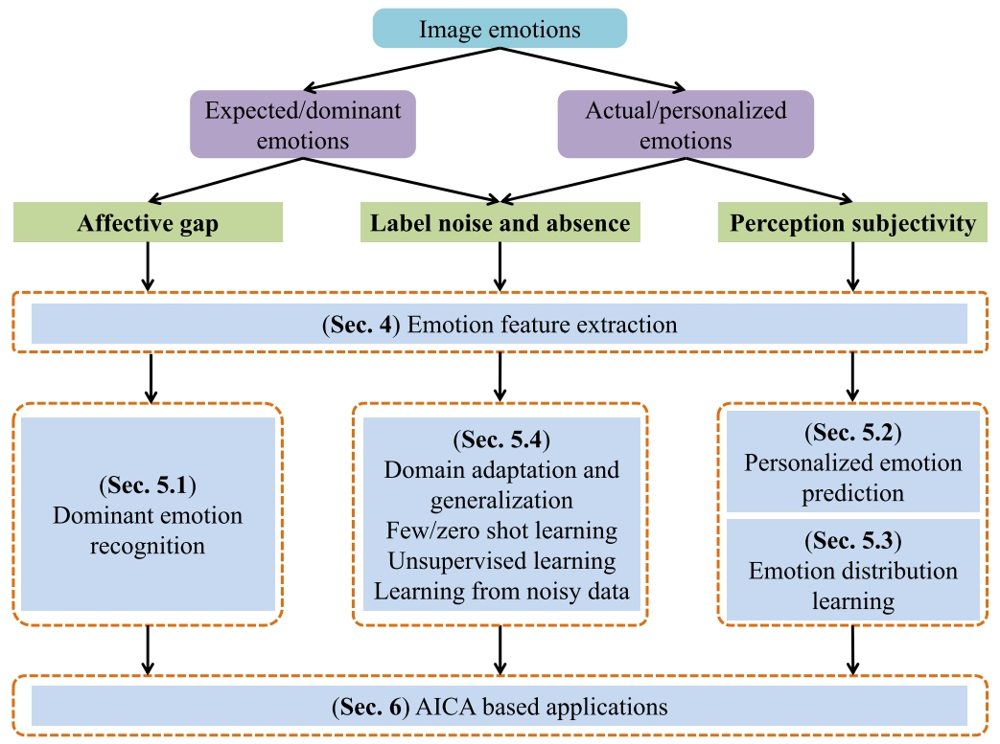








Welcome! I am Guoli Jia (贾国力 in Chinese). I am a third-year master's student at  the [School of Computer Science](https://cc.nankai.edu.cn/), [Nankai University](https://www.nankai.edu.cn/), advised by Prof. [Jufeng Yang](https://cv.nankai.edu.cn/). Prior to my master's career, I received my bachelor's degree at the School of [Software Engineering](http://www.sei.ecnu.edu.cn/), [East China Normal University](https://www.ecnu.edu.cn/) in 2021.

My research interests include computer vision and multi-modal learning, particularly focusing on **semi-supervised image recognition**, **affective computing**. I am always looking for related collaborations, and most of them have produced top-level publications. Feel free to drop me an <a href="mailto:exped1230@gmail.com" target="_blank">email</a> if you are interested!

# 📖 Educations
- *2021.09 - 2024.06 (now)*, Master student of Nankai University. 
- *2017.09 - 2021.07*, Undergraduate students of East China Normal University.

# 🔥 News
* **[2024.02.02]** &nbsp;🎉🎉 1 paper is accepted to [TAFFC](https://ieeexplore.ieee.org/xpl/RecentIssue.jsp?punumber=5165369).
* **[2023.11.02]** &nbsp;🎖🎖 I receive the first prize of the Nankai University Public Scholarship.
* **[2023.05.08]** &nbsp;🎖🎖 I receive the SK AI Innovation Scholarship from Korea.
* **[2023.02.28]** &nbsp;🎉🎉 1 paper is accepted to [CVPR 2023](https://cvpr.thecvf.com/Conferences/2023).
* **[2022.07.04]** &nbsp;🎉🎉 1 paper is accepted to [ECCV 2022](https://eccv2022.ecva.net/).
* **[2022.06.30]** &nbsp;🎉🎉 1 paper is accepted to [ACM MM 2022](https://2022.acmmm.org/).

# 📝 Publications 

CVPR 2024

 Pancheng Zhao, Peng Xu, Pengda Qin, Dengping Fan, Zhicheng Zhang, <u>Guoli Jia</u>, Bowen Zhou, Jufeng Yang, &quot;**LAKE-RED: Camouflaged Images Generation by Latent Background Knowledge Retrieval-Augmented Diffusion**&quot;. In *Proceedings of the IEEE/CVF Conference on Computer Vision and Pattern Recognition (CVPR) 2024*. 

[[pdf](https://arxiv.org/pdf/2404.00292)][[code](https://github.com/PanchengZhao/LAKE-RED)]

TAFFC

 Yingjie Zhai†, <u>Guoli Jia†</u>, Yukun Lai, Jing Zhang, Jufeng Yang, Dacheng Tao, &quot;**Looking into Gait for Perceiving Emotions via Bilateral Posture and Movement Graph Convolutional Networks**&quot;. In *IEEE Transactions on Affective Computing (TAFFC) 2024*. 

[[pdf](https://ieeexplore.ieee.org/abstract/document/10433680)] [[code](https://github.com/exped1230/BPM-GCN)] [[project](https://exped1230.github.io/BPM-GCN/GaitEmotion-BPM-GCN/index.html)]

CVPR 2023

 Changsong Wen†, <u>Guoli Jia</u>†, Jufeng Yang, &quot;**DIP: Dual Incongruity Perceiving Network for Sarcasm Detection**&quot;. In *Proceedings of the IEEE/CVF Conference on Computer Vision and Pattern Recognition (CVPR) 2023*.

[[pdf](https://openaccess.thecvf.com/content/CVPR2023/papers/Wen_DIP_Dual_Incongruity_Perceiving_Network_for_Sarcasm_Detection_CVPR_2023_paper.pdf)] [[code](https://github.com/downdric/MSD)]

ECCV 2022

 <u>Guoli Jia</u>, Jufeng Yang, &quot;**S2-VER: Semi-supervised Visual Emotion Recognition**&quot;. In *European Conference on Computer Vision*.

[[pdf](https://www.ecva.net/papers/eccv_2022/papers_ECCV/papers/136970483.pdf)] [[code](https://github.com/exped1230/S2-VER)] [[poster](https://github.com/exped1230/S2-VER/blob/main/S2-VER_poster.pdf)]

ACM MM 2022

 Lijuan Wang†, <u>Guoli Jia</u>†, Ning Jiang, Haiying Wu, Jufeng Yang, &quot;**EASE: Robust facial expression recognition via emotion Ambiguity-SEnsitive cooperative networks**&quot;. In *Proceedings of the 30th ACM International Conference on Multimedia*.

[[pdf](https://dl.acm.org/doi/abs/10.1145/3503161.3548005)]

SPM

 Sicheng Zhao, <u>Guoli Jia</u>, Jufeng Yang, Guiguang Ding, Kurt Keutzer, &quot;**Emotion Recognition From Multiple Modalities: Fundamentals and methodologies**&quot;. In *IEEE Signal Processing Magazine (SPM)*.

[[pdf](https://ieeexplore.ieee.org/abstract/document/9591550)]

TPAMI

 Sicheng Zhao, Xingxu Yao, Jufeng Yang, <u>Guoli Jia</u>, Guiguang Ding, Tat-Seng CHua, 
Björn W. Schuller, 
Kurt Keutzer, &quot;**Affective Image Content Analysis: Two Decades Review and New Perspectives**&quot;. In *IEEE Transactions on Pattern Analysis and Machine Intelligence (TPAMI)*.

[[pdf](https://ieeexplore.ieee.org/abstract/document/9472932/)] [[code](https://github.com/exped1230/AICA)] [[poster](https://github.com/exped1230/AICA/blob/main/poster.pdf)]

