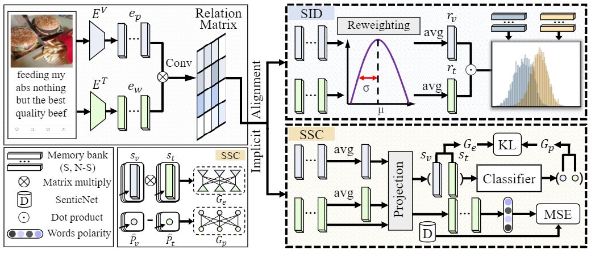
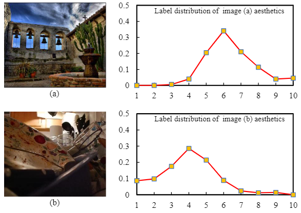








Welcome! I am Guoli Jia (贾国力 in Chinese). I am a third-year master's student at  the [School of Computer Science](https://cc.nankai.edu.cn/), [Nankai University](https://www.nankai.edu.cn/), advised by Prof. [Jufeng Yang](https://cv.nankai.edu.cn/). Prior to my master's career, I received my bachelor's degree at the School of [Software Engineering](http://www.sei.ecnu.edu.cn/), [East China Normal University](https://www.ecnu.edu.cn/) in 2021.

My research interests include computer vision and multi-modal learning, particularly focusing on **semi-supervised image recognition**, **affective computing**. I am always looking for related collaborations, and most of them have produced top-level publications. Feel free to drop me an <a href="mailto:exped1230@gmail.com" target="_blank">email</a> if you are interested!

# 📖 Educations
- *2021.09 - 2024.06 (now)*, Master student of Nankai University. 
- *2017.09 - 2021.07*, Undergraduate students of East China Normal University.

# 🔥 News
* **[2024.02.02]** &nbsp;🎉🎉 1 paper is accepted to [TAFFC](https://ieeexplore.ieee.org/xpl/RecentIssue.jsp?punumber=5165369).
* **[2023.11.02]** &nbsp;🎖🎖 I receive the first prize of the Nankai University Public Scholarship.
* **[2023.05.08]** &nbsp;🎖🎖 I receive the SK AI Innovation Scholarship from Korea.
* **[2023.02.28]** &nbsp;🎉🎉 1 paper is accepted to [CVPR 2023](https://cvpr.thecvf.com/Conferences/2023).
* **[2022.07.04]** &nbsp;🎉🎉 1 paper is accepted to [ECCV 2022](https://eccv2022.ecva.net/).
* **[2022.06.30]** &nbsp;🎉🎉 1 paper is accepted to [ACM MM 2022](https://2022.acmmm.org/).

# 📝 Publications 

CVPR 2023

 Changsong Wen†, <u>Guoli Jia</u>†, Jufeng Yang, &quot;**DIP: Dual Incongruity Perceiving Network for Sarcasm Detection**&quot;. In *Proceedings of the IEEE/CVF Conference on Computer Vision and Pattern Recognition (CVPR) 2024*.

[[pdf](https://openaccess.thecvf.com/content/CVPR2023/papers/Wen_DIP_Dual_Incongruity_Perceiving_Network_for_Sarcasm_Detection_CVPR_2023_paper.pdf)] [[code](https://github.com/downdric/MSD)]

ICCV 2023

[Ordinal Label Distribution Learning]
(https://openaccess.thecvf.com/content/ICCV2023/papers/Wen_Ordinal_Label_Distribution_Learning_ICCV_2023_paper.pdf)
**Changsong Wen**, Xin Zhang, Xingxu Yao, Jufeng Yang

[**Project**](https://downdric23.github.io/) 
- This paper integrates ordinal relations between labels and proposes an Ordinal Label Distribution Learning (OLDL) paradigm.  

